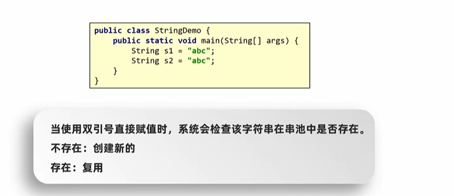
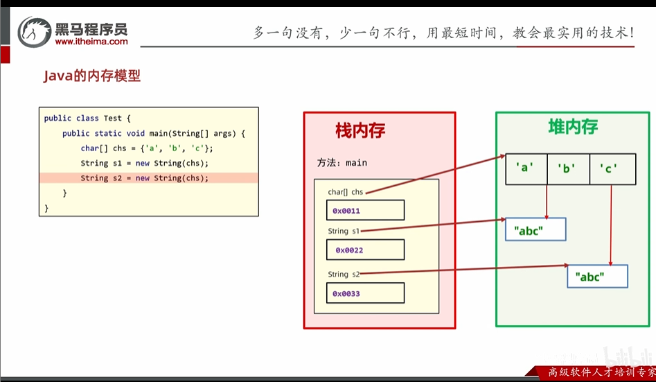

# 字符串

## 基本定义

1. 是Java定义好的一个类，使用的时候不需要导包
2. 所有字符串文字都被实为此类的对象
3. 字符串不可变，==在创建后不能被更改==

## 创建字符串方式

```java
public class StringDemo {
    public static void main(String[] args) {
        // 直接赋值
        String s1 = "abc";
        System.out.println(s1);
        //new
        String s2 = new String("123");
        System.out.println(s2);
    }
}
```

1. 直接赋值

会复用



2. new

每次创建新的



## 字符串常用操作

1. 字符串比较

```java
public class StringDemo2 {
    public static void main(String[] args) {
        String s1 = new String("ABC");
        String s2 = "abc";
        //比较地址
        System.out.println(s1 == s2);
        //比较值
        //严格比较
        boolean result1 = s1.equals(s2);
        System.out.println(result1);
        //忽略大小写
        boolean result2 = s1.equalsIgnoreCase(s2);
        System.out.println(result2);
    }
}
```

