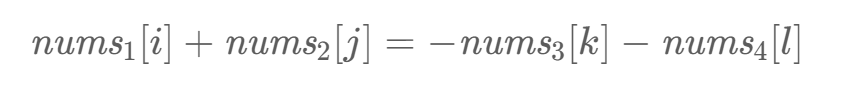

# Day_7 哈希2

## 454.四数相加

### 题目

https://leetcode.cn/problems/4sum-ii/description/

给你四个整数数组 `nums1`、`nums2`、`nums3` 和 `nums4` ，数组长度都是 `n` ，请你计算有多少个元组 `(i, j, k, l)` 能满足：

- `0 <= i, j, k, l < n`
- `nums1[i] + nums2[j] + nums3[k] + nums4[l] == 0`

### 解答

本题解题步骤：

1. 首先定义 一个unordered_map，key放a和b两数之和，value 放a和b两数之和出现的次数。
2. 遍历大A和大B数组，统计两个数组元素之和，和出现的次数，放到map中。
3. 定义int变量count，用来统计 a+b+c+d = 0 出现的次数。
4. 再遍历大C和大D数组，找到如果 0-(c+d) 在map中出现过的话，就用count把map中key对应的value也就是出现次数统计出来。
5. 
6. 最后返回统计值 count 就可以了

```c++
class Solution {
public:
    int fourSumCount(vector<int>& nums1, vector<int>& nums2, vector<int>& nums3, vector<int>& nums4) {
        unordered_map<int,int> cnt;
        for(int x:nums1){
            for(int y:nums2){
                cnt[x+y]++;
            }
        }
        int ans=0;
        for(int x:nums3){
            for(int y:nums4){
                ans += cnt[-x-y];
            }
        }
        return ans;
    }
};
```

## 383.赎金信

### 题目

给你两个字符串：`ransomNote` 和 `magazine` ，判断 `ransomNote` 能不能由 `magazine` 里面的字符构成。

如果可以，返回 `true` ；否则返回 `false` 。

`magazine` 中的每个字符只能在 `ransomNote` 中使用一次。

### 解答

```c
class Solution {
public:
    bool canConstruct(string ransomNote, string magazine) {
        vector<int> r(26,0);
        for(char a:magazine){
            r[a-'a']++;
        }
        for(char c:ransomNote){
            r[c-'a']--;
            if(r[c-'a']<0) return false;
        }
        return true;
    }
};
```

## 15.三数之和

### 题目

给你一个整数数组 `nums` ，判断是否存在三元组 `[nums[i], nums[j], nums[k]]` 满足 `i != j`、`i != k` 且 `j != k` ，同时还满足 `nums[i] + nums[j] + nums[k] == 0` 。请你返回所有和为 `0` 且不重复的三元组。

**注意：**答案中不可以包含重复的三元组。

### 题解

灵神的这个视频包含基本思路

[【基础算法精讲 01】](https://leetcode.cn/link/?target=https%3A%2F%2Fwww.bilibili.com%2Fvideo%2FBV1bP411c7oJ%2F)

关键在于：

- 枚举第一个数，把三数之和变成两数之和
- 去重的小技巧，只有是答案，且存在相同的数字时才会出现重复！！注意必须是答案，否则i，j相等的情况就会被忽略

```c++
class Solution {
public:
    vector<vector<int>> threeSum(vector<int>& nums) {
        ranges::sort(nums);//这里要加ranges不然识别不出来，不知道为啥
        vector<vector<int>> ans;
        int n=nums.size();
        for(int i=0;i<n-2;i++){
            int x=nums[i];
            if(i&&x==nums[i-1])continue;//跳过重复数字和防止数组越界，太牛了
            int j=i+1,k=n-1;
            while(j<k){
                int s = x+nums[j]+nums[k];
                if(s>0)k--;
                else if(s<0)j++;
                else{
                    ans.push_back({x,nums[j],nums[k]});
                    for(j++;j<k&&nums[j]==nums[j-1];j++);//去重，非常triky
                    for(k--;k>j&&nums[k]==nums[k+1];k--);
                }                
            }
        }
        return ans;
    }
};
```

## 18.四数之和TBD

