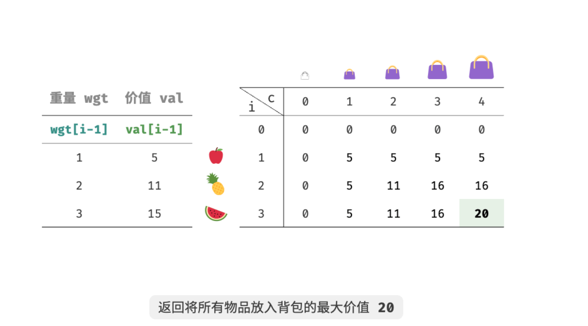
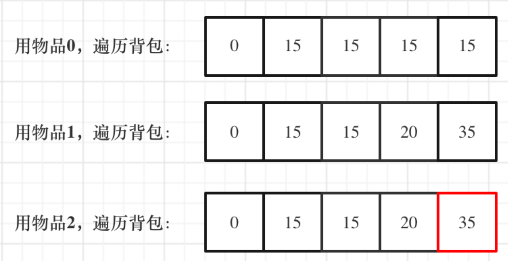

# 动态规划03

## 0-1背包类问题以及应用

### 问题介绍

首先是最基础的0-1背包问题

> 给定 $n $个物品，第 $i $个物品的重量为 $wgt[i]$、价值为 $val[i]$ ，和一个容量为 $cap $的背包。每个物品只能选择一次，问在限定背包容量下能放入物品的最大价值。

### 问题分析

#### 1.二维数组

可以将 0-1 背包问题看作一个由 $n$ 轮决策组成的过程，对于每个物体都有不放入和放入两种决策。

- **第一步：确定dp数组以及下标**

对于每个物品来说，不放入背包，背包容量不变；放入背包，背包容量减小。由此可得状态定义：当前物品编号$ i $和背包容量 $c $，记为 $[i,c]$（编号从0开始） 。

状态 $[i,c]$ 对应的子问题为：**前 $i$ 个物品在容量为 $c$ 的背包中的最大价值**，记为 $dp[i,c]$ 。

待求解的是 $dp[n,cap]$ ，因此需要一个尺寸为$ n×(cap+1)$ 的二维 $dp$ 表。

- **第二步：确定递推公式**

当我们做出物品 $i$ 的决策后，剩余的是前 $i−1$ 个物品决策的子问题，可分为以下两种情况。

**不放入物品$ i$** ：背包容量不变，状态变化为 $[i−1,c]$ 
**放入物品$ i$** ：背包容量减少 $wgt[i] $，价值增加 $val[i]$ ，状态变化为 $[i,c−wgt[i]]$ 

**综上，最大价值 $dp[i,c] $等于不放入物品 i 和放入物品 i 两种方案中价值更大的那一个**。由此可推导出状态转移方程：
$$
dp[i,c]=max(dp[i−1,c],dp[i−1,c−wgt[i]]+val[i])
$$


> Tips：若当前物品重量 $wgt[i−1] $超出剩余背包容量$ c$ ，则只能选择不放入背包。

- **第三步：dp数组如何初始化**

首先从$dp[i][c]$的定义出发，如果背包容量$c$为$0$的话，即$dp[i][0]$，无论是选取哪些物品，背包价值总和一定为0。

状态转移方程可以看出$i $是由 $i-1 $推导出来，那么i为0的时候就一定要初始化。

$dp[0][c]$，即：i为0，存放编号0的物品的时候，各个容量的背包所能存放的最大价值。

那么很明显当 `c < wgt[0]`的时候，$dp[0][c] $应该是$ 0$，因为背包容量比编号0的物品重量还小。

当`c >= wgt[0]`时，$dp[0][c]$ 应该是$val[0]$，因为背包容量放足够放编号0物品。

- **第四步：确定遍历顺序**

当前状态$ [i,c] $从上方的状态$ [i−1,c]$ 和左上方的状态$ [i−1,c−wgt[i]]$ 转移而来，因此通过两层循环正序遍历整个 dp 表即可。

- **第五步：举例推导数组**

下面是一个网上的小例子



#### 2.一维数组

在使用二维数组的时候，递推公式：$dp[i][c] = max(dp[i - 1][c], dp[i - 1][c - weight[i]] + value[i])$;

**其实可以发现如果把$dp[i - 1]$那一层拷贝到$dp[i]$上(整行复制)，表达式完全可以是：$dp[i][c] = max(dp[i][c], dp[i][c - weight[i]] + value[i])$，也就是说，只要有了上一层的数据，这一层就能算出来;**

**与其把$dp[i - 1]$这一层拷贝到$dp[i]$上，不如只用一个一维数组了**，只用$dp[c]$（一维数组，也可以理解是一个滚动数组）。

这就是滚动数组的由来，需要满足的条件是上一层可以重复利用，直接拷贝到当前层。

其他条件相同，就在上面递推公式的基础上，去掉$i$这个维度就好。

- 递推公式为：$dp[c] = max(dp[c], dp[c - weight[i]] + value[i])$

- 初始化：第一行的上一行可以看作是没有物品可选的背包问题，因此价值都为0

- ==遍历顺序==：因为需要前面的数据呀，所以显然不能从左往右遍历，必须从右往左遍历，因为右边的数据不会用到（二维数组也可以从右往左，不过不符合$dp$的习惯吧）

- 例子：

  背包最大重量为4。

  物品为：

  |       | 重量 | 价值 |
  | ----- | ---- | ---- |
  | 物品0 | 1    | 15   |
  | 物品1 | 3    | 20   |
  | 物品2 | 4    | 30   |

  

## 题目应用

### 416. 分割等和子集

==中等==  30min

#### 题目

  给你一个 **只包含正整数** 的 **非空** 数组 `nums` 。请你判断是否可以将这个数组分割成两个子集，使得两个子集的元素和相等。

   

  **示例 1：**

  ```
  输入：nums = [1,5,11,5]
  输出：true
  解释：数组可以分割成 [1, 5, 5] 和 [11] 。
  ```

  **示例 2：**

  ```
  输入：nums = [1,2,3,5]
  输出：false
  解释：数组不能分割成两个元素和相等的子集。
  ```

   

  **提示：**

  - `1 <= nums.length <= 200`
  - `1 <= nums[i] <= 100`

  #### 题解

  本来也是没啥想法，但是提示可以用背包解决哎，很明显每个数字的大小就可以同时看作价值和重量，数字总和的一半就是背包大小，如果有一组数据可以填满这个背包，且总价值等于背包大小，则剩下的肯定也和背包大小一致，也就是可以划分成两个

  

  ```c++
  class Solution {
  public:
      bool canPartition(vector<int>& nums) {
          int len=nums.size();
          int sum=0;
          for(int i=0;i<len;i++)sum+=nums[i];//求和喵
          if(sum%2)return false;//如果是奇数直接判负
          int c = sum/2;//背包大小
          vector<vector<int>> dp(len,vector<int>(c+1,0));
          for(int j=0;j<=c;j++)
          {
              if(j>nums[0])dp[0][j]=nums[0];
          }//初始化第一行
          for(int i=1;i<len;i++){
              for(int j=0;j<=c;j++){
                  if(j<nums[i])dp[i][j]=dp[i-1][j];//当前背包大小放不下第i个数，只能不放这个数
                  else dp[i][j]=max(dp[i-1][j],dp[i-1][j-nums[i]]+nums[i]);//不放这个数vs放这个数
              }
          }
          return dp[len-1][c] == c;
      }
  };
  ```

  这道题有灵神讲解[0-1 背包和完全背包【基础算法精讲 18】](https://leetcode.cn/link/?target=https%3A%2F%2Fwww.bilibili.com%2Fvideo%2FBV16Y411v7Y6%2F)，也可以用dfs等解决就是有可能搜爆，01背包相对于本题，主要要理解，题目中物品是$nums[i]$，重量是$nums[i]$，价值也是$nums[i]$，背包体积是$sum/2$

  ### **1049. 最后一块石头的重量 II** 

==中等== 20min

#### 题目 

有一堆石头，用整数数组 `stones` 表示。其中 `stones[i]` 表示第 `i` 块石头的重量。

每一回合，从中选出**任意两块石头**，然后将它们一起粉碎。假设石头的重量分别为 `x` 和 `y`，且 `x <= y`。那么粉碎的可能结果如下：

- 如果 `x == y`，那么两块石头都会被完全粉碎；
- 如果 `x != y`，那么重量为 `x` 的石头将会完全粉碎，而重量为 `y` 的石头新重量为 `y-x`。

最后，**最多只会剩下一块** 石头。返回此石头 **最小的可能重量** 。如果没有石头剩下，就返回 `0`。

 

**示例 1：**

```
输入：stones = [2,7,4,1,8,1]
输出：1
解释：
组合 2 和 4，得到 2，所以数组转化为 [2,7,1,8,1]，
组合 7 和 8，得到 1，所以数组转化为 [2,1,1,1]，
组合 2 和 1，得到 1，所以数组转化为 [1,1,1]，
组合 1 和 1，得到 0，所以数组转化为 [1]，这就是最优值。
```

**示例 2：**

```
输入：stones = [31,26,33,21,40]
输出：5
```

 

**提示：**

- `1 <= stones.length <= 30`
- `1 <= stones[i] <= 100`

#### 题解

这道题感觉和前面那个很像，就是变种，区别是如果填不满的话，$（背包大小-总重量）\times 2$ 就是剩下最小石头的大小啦（如果是奇数再加一），这个举几个例子就能看出来

```c++
class Solution {
public:
    int lastStoneWeightII(vector<int>& stones) {
        int n=stones.size();
        int r=0;//剩下石头的大小
        int sum=0;
        for(int i=0;i<n;i++)sum+=stones[i];
        if(sum%2)r=1;//如果是奇数，即使完全填满也要加一啊
        int c=sum/2;
        vector<vector<int>> dp(n,vector<int>(c+1,0));
        for(int j=0;j<=c;j++)
        {
            if(j>=stones[0])dp[0][j]=stones[0];
        }
        for(int i=1;i<n;i++)
        {
            for(int j=0;j<=c;j++){
                if(stones[i]>j)dp[i][j]=dp[i-1][j];
                else dp[i][j] = max(dp[i-1][j],dp[i-1][j-stones[i]]+stones[i]);
            }
        }
        r += (c-dp[n-1][c])*2;//计算小石头大小
        return r;
    }
};
```

  这题再练一下用一维数组解决的方法，代码会简单很多

```c++
class Solution {
public:
    int lastStoneWeightII(vector<int>& stones) {
        
        int sum = 0;
        for (int i = 0; i < stones.size(); i++) sum += stones[i];
        int target = sum / 2;
        vector<int> dp(target+1, 0);
        for (int i = 0; i < stones.size(); i++) { // 遍历物品
            for (int j = target; j >= stones[i]; j--) { // 遍历背包,但是从右往左
                dp[j] = max(dp[j], dp[j - stones[i]] + stones[i]);
            }
        }
        return sum - dp[target] - dp[target];
    }
};
```

### 494.目标和 

==中等== 40min

#### 题目

给你一个非负整数数组 `nums` 和一个整数 `target` 。

向数组中的每个整数前添加 `'+'` 或 `'-'` ，然后串联起所有整数，可以构造一个 **表达式** ：

- 例如，`nums = [2, 1]` ，可以在 `2` 之前添加 `'+'` ，在 `1` 之前添加 `'-'` ，然后串联起来得到表达式 `"+2-1"` 。

返回可以通过上述方法构造的、运算结果等于 `target` 的不同 **表达式** 的数目。

 

**示例 1：**

```
输入：nums = [1,1,1,1,1], target = 3
输出：5
解释：一共有 5 种方法让最终目标和为 3 。
-1 + 1 + 1 + 1 + 1 = 3
+1 - 1 + 1 + 1 + 1 = 3
+1 + 1 - 1 + 1 + 1 = 3
+1 + 1 + 1 - 1 + 1 = 3
+1 + 1 + 1 + 1 - 1 = 3
```

**示例 2：**

```
输入：nums = [1], target = 1
输出：1
```

 

**提示：**

- `1 <= nums.length <= 20`
- `0 <= nums[i] <= 1000`
- `0 <= sum(nums[i]) <= 1000`
- `-1000 <= target <= 1000`

#### 题解

如果不是在背包问题下看到这道题可能会考虑深搜和暴力吧hh

同样的因为在背包题下看到，加上前面那两题的基础，想到哎嘿不就是分成一坨加，一坨减总共两坨嘛

**此时问题就转化为，用nums装满容量为c的背包，有几种方法**。

思考一下这两坨中的其中一坨可以表示为$c=(target + sum) / 2$

显然这个数如果是小数就不可能有解，且如果$target$ 的绝对值已经大于$sum$，那么也是没有方案的。

```cpp
if (abs(target) > sum) return 0; // 此时没有方案
if ((target + sum) % 2) return 0; // 此时没有方案
```

这次和之前遇到的背包问题不一样了，之前都是求容量为$j$的背包，最多能装多少。本题则是装满有几种方法。其实这就是一个**组合问题**了。

所有的$dp$问题都可以先列个表找下规律，然后按照$dp$的步骤做

1. **确定$dp$数组以及下标的含义：**先用 二维$ dp$数组求解本题，$dp[i][j]$：使用 下标为$i$以内的数字能够凑满$j$（包括$j$）这么大容量的包，有$dp[i][j]$种方法。
2. **确定递推公式：**这个只能靠想吧，然后结合一下背包的思想，有两种情况，一种是放自己，一种是不放自己
   - **不放物品$i$**：即背包容量为$j$，里面不放物品$i$，装满有$dp[i - 1][j]$种方法。
   - **放物品$i$**： 即：先空出物品$i$的容量，背包容量为$（j - 物品i容量）$，放满背包有 $dp[i - 1][j - 物品i容量] $种方法。

本题中，物品i的容量是$nums[i]$，价值也是$nums[i]$。

递推公式：$dp[i][j] = dp[i - 1][j] + dp[i - 1][j - nums[i]]$;

同样的，我们发现只用到上一行的数据了，也就是可以压缩成一维数组，压缩之后，递推公式：$dp[j] = dp[j] + dp[j - nums[i]]$

3. **dp数组如何初始化:**分析可得，$dp[0][0] = 1$ ，即$dp[0] = 1$ 。
4. **确定遍历顺序：**倒序进行遍历。
5. **举例推导dp数组：**这个自己算算验证一下

最后转化为一维数组，代码情况如下：

```c++
class Solution {
public:
    int findTargetSumWays(vector<int>& nums, int target) {
        int sum = 0;
        for (int i = 0; i < nums.size(); i++) sum += nums[i];
        if (abs(target) > sum) return 0; // 此时没有方案
        if ((target + sum) % 2 == 1) return 0; // 此时没有方案
        int bagSize = (target + sum) / 2;
        vector<int> dp(bagSize + 1, 0);
        dp[0] = 1;
        for (int i = 0; i < nums.size(); i++) {
            for (int j = bagSize; j >= nums[i]; j--) {
                dp[j] += dp[j - nums[i]];
            }
        }
        return dp[bagSize];
    }
};
```

