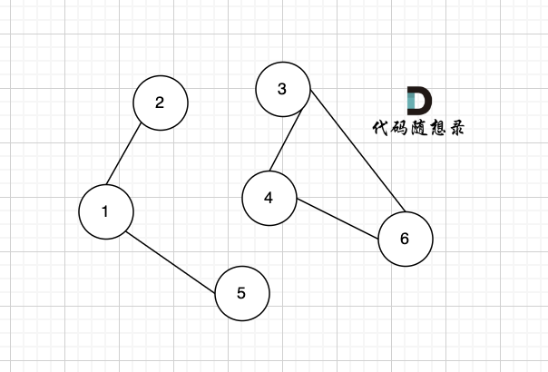
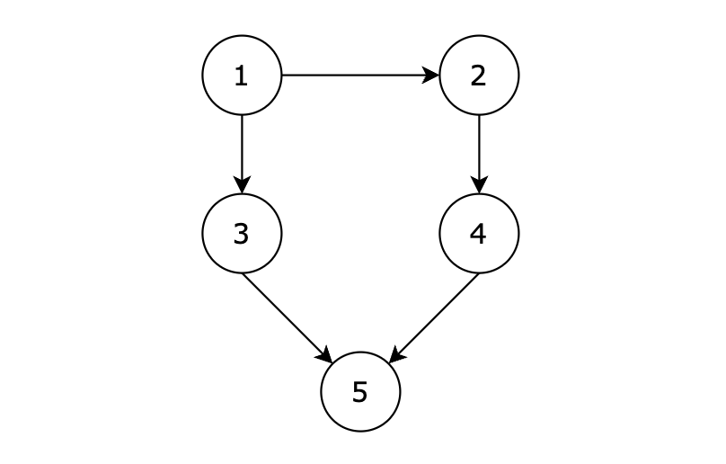
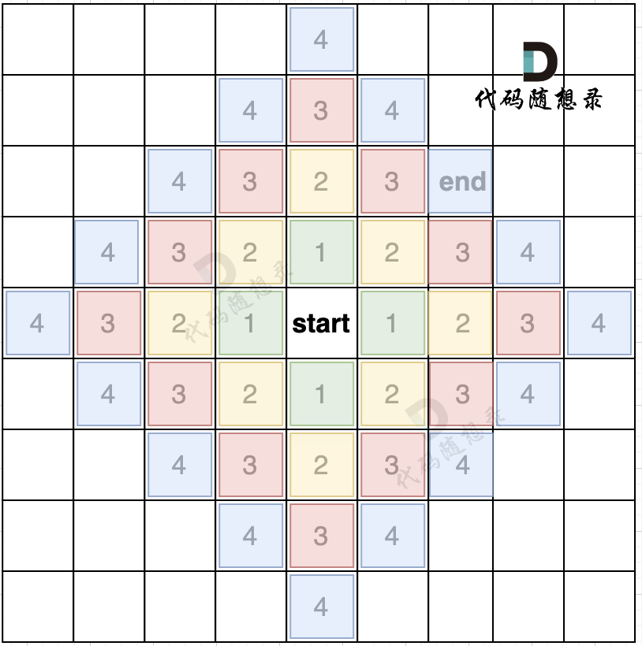

# 图论01

## 基础知识

### 图的基本概念

1. **有向图**和**无向图**：有向图是指图中边是有方向的，无向图是指图中边没有方向。

2. **度：**无向图中有几条边连接该节点，该节点就有几度。

​	在有向图中，每个节点有出度和入度。

​	出度：从该节点出发的边的个数。

​	入度：指向该节点边的个数。

3. **连通图：**在无向图中，任何两个节点都是可以到达的，我们称之为连通图 ，如果有节点不能到达其他节点，则为非连通图，
4. **强连通图：**在有向图中，任何两个节点是可以==相互到达==的，我们称之为 强连通图。

- 这个图是连通图但不是强连通图，节点1可以到节点5，但节点5 不能到节点1

  

5. **连通分量：**在无向图中的==极大==连通子图称之为该图的一个连通分量。

- 该无向图中 `节点1、节点2、节点5` 构成的子图就是 该无向图中的一个连通分量，该子图所有节点都是相互可达到的。

  同理，`节点3、节点4、节点6 `构成的子图 也是该无向图中的一个连通分量。

  但是 `节点3 、节点4` 构成的子图不是该无向图的联通分量

  因为必须是==极大联通子图==才能是连通分量，所以 必须是节点`节点3、节点4、节点6`构成的子图才是连通分量。

  

6. **强连通分量：**在有向图中极大强连通子图称之为该图的强连通分量。

### 图的构造

1. 朴素存储

图中有8条边，我们就定义 8 * 2的数组，即有n条边就申请n * 2，这么大的数组：


数组第一行：6 7，就表示节点6 指向 节点7，以此类推。

2. 邻接矩阵

邻接矩阵使用二维数组来表示图结构。 邻接矩阵是从节点的角度来表示图，有多少节点就申请多大的二维数组。

例如：` grid[2][5] = 6`，表示 节点 2 连接 节点5 为有向图，节点2 指向 节点5，边的权值为6。

如果想表示无向图，即：`grid[2][5] = 6`，`grid[5][2] = 6`，表示节点2 与 节点5 相互连通，权值为6。

如图：


在一个 n （节点数）为8 的图中，就需要申请 8 * 8 这么大的空间。

图中有一条双向边，即：`grid[2][5] = 6`，`grid[5][2] = 6`

这种表达方式（邻接矩阵） 在 边少，节点多的情况下，会导致申请过大的二维数组，造成空间浪费。

而且在寻找节点连接情况的时候，需要遍历整个矩阵，即 n * n 的时间复杂度，同样造成时间浪费。

邻接矩阵的优点：

- 表达方式简单，易于理解
- 检查任意两个顶点间是否存在边的操作非常快
- 适合稠密图，在边数接近顶点数平方的图中，邻接矩阵是一种空间效率较高的表示方法。

缺点：

- 遇到稀疏图，会导致申请过大的二维数组造成空间浪费 且遍历 边 的时候需要遍历整个n * n矩阵，造成时间浪费

3. 邻接表

邻接表 使用 数组 + 链表的方式来表示。 邻接表是从边的数量来表示图，有多少边 才会申请对应大小的链表。

邻接表的构造如图：


这里表达的图是：

- 节点1 指向 节点3 和 节点5
- 节点2 指向 节点4、节点3、节点5
- 节点3 指向 节点4
- 节点4指向节点1

有多少边 邻接表才会申请多少个对应的链表节点。

从图中可以直观看出 使用 数组 + 链表 来表达 边的连接情况 。

邻接表的优点：

- 对于稀疏图的存储，只需要存储边，空间利用率高
- 遍历节点连接情况相对容易

缺点：

- 检查任意两个节点间是否存在边，效率相对低，需要 O(V)时间，V表示某节点连接其他节点的数量。
- 实现相对复杂，不易理解

### 图的遍历方式

图的遍历方式基本是两大类：

- 深度优先搜索（dfs）
- 广度优先搜索（bfs）

在讲解二叉树章节的时候，其实就已经讲过这两种遍历方式。

二叉树的递归遍历，是dfs 在二叉树上的遍历方式。

二叉树的层序遍历，是bfs 在二叉树上的遍历方式。

dfs 和 bfs 一种搜索算法，可以在不同的数据结构上进行搜索，在二叉树章节里是在二叉树这样的数据结构上搜索。

而在图论章节，则是在图（邻接表或邻接矩阵）上进行搜索。

### 深度优先搜索

正是因为dfs搜索可一个方向，并需要回溯，所以用递归的方式来实现是最方便的。

```cpp
void dfs(参数) {
    处理节点
    dfs(图，选择的节点); // 递归
    回溯，撤销处理结果
}
```


回溯算法，其实就是dfs的过程，这里给出dfs的代码框架：

```cpp
void dfs(参数) {
    if (终止条件) {
        存放结果;
        return;
    }

    for (选择：本节点所连接的其他节点) {
        处理节点;
        dfs(图，选择的节点); // 递归
        回溯，撤销处理结果
    }
}
```

可以发现dfs的代码框架和回溯算法的代码框架是差不多的。

## 98.所有可达路径

### 题目

**题目描述**

给定一个有 n 个节点的有向无环图，节点编号从 1 到 n。请编写一个函数，找出并返回所有从节点 1 到节点 n 的路径。每条路径应以节点编号的列表形式表示。

**输入描述**

第一行包含两个整数 N，M，表示图中拥有 N 个节点，M 条边

后续 M 行，每行包含两个整数 s 和 t，表示图中的 s 节点与 t 节点中有一条路径

**输出描述**

输出所有的可达路径，路径中所有节点之间空格隔开，每条路径独占一行，存在多条路径，路径输出的顺序可任意。如果不存在任何一条路径，则输出 -1。

**注意输出的序列中，最后一个节点后面没有空格！** 例如正确的答案是 `1 3 5`,而不是 `1 3 5 `， 5后面没有空格！

**输入示例**

```
5 5
1 3
3 5
1 2
2 4
4 5
```

**输出示例**

```
1 3 5
1 2 4 5
```

**提示信息**




**用例解释：**

有五个节点，其中的从 1 到达 5 的路径有两个，分别是 1 -> 3 -> 5 和 1 -> 2 -> 4 -> 5。

因为拥有多条路径，所以输出结果为：

1 3 5
1 2 4 5

或

1 2 4 5
1 3 5
都算正确。

**数据范围：**

- 图中不存在自环
- 图中不存在平行边
- 1 <= N <= 100
- 1 <= M <= 500

### 题解

dfs本身没什么难度，用acm模式练一下输入输出

```c++
#include<iostream>
#include<vector>
using namespace std;
vector<vector<int>> ans;
vector<int> path;
void dfs(vector<vector<int>>& graph,int idx,int n){
    if(idx==n){
    ans.push_back(path);
    return;
    }
    for(int i=1;i<=n;i++){
        if(graph[idx][i]==1){
            path.push_back(i);
            dfs(graph,i,n);
            path.pop_back();
        }
    }
}
int main ()
{
    int n,m;
    cin>>n>>m;
    vector<vector<int>> graph(n+1,vector<int>(n+1,0));//开n+1是为了输入的时候下标对齐
    for(int i=0;i<m;i++){
        int a,b;
        cin>>a>>b;
        graph[a][b]=1;
    }
    path.push_back(1);
    dfs(graph,1,n);
    if(ans.size()==0) cout<<-1<<endl;
    for(auto x:ans){
        for(int i=0;i<x.size()-1;i++)
        {
            cout<<x[i]<<" ";
        }
        cout<<x[x.size()-1]<<endl;
    }
    return 0;

}
```

## 广度优先搜索

==最短路径问题==简直是天选广搜方法了，提到最短路径，广搜就完了

我们用一个方格地图，假如每次搜索的方向为 上下左右（不包含斜上方），那么给出一个start起始位置，那么BFS就是从四个方向走出第一步。


如果加上一个end终止位置，那么使用BFS的搜索过程如图所示：



我们从图中可以看出，从start起点开始，是一圈一圈，向外搜索，方格编号1为第一步遍历的节点，方格编号2为第二步遍历的节点，第四步的时候我们找到终止点end。

正是因为BFS一圈一圈的遍历方式，所以一旦遇到终止点，那么一定是一条最短路径。

而且地图还可以有障碍，如图所示：


在第五步，第六步 我只把关键的节点染色了，其他方向周边没有去染色，大家只要关注关键地方染色的逻辑就可以。

从图中可以看出，如果添加了障碍，我们是第六步才能走到end终点。

只要BFS只要搜到终点一定是一条最短路径，大家可以参考上面的图，自己再去模拟一下。

### 代码框架

大家应该好奇，这一圈一圈的搜索过程是怎么做到的，是放在什么容器里，才能这样去遍历。

很多网上的资料都是直接说用队列来实现。

其实，我们仅仅需要一个容器，能保存我们要遍历过的元素就可以，**那么用队列，还是用栈，甚至用数组，都是可以的**。

**用队列的话，就是保证每一圈都是一个方向去转，例如统一顺时针或者逆时针**。

因为队列是先进先出，加入元素和弹出元素的顺序是没有改变的。

**如果用栈的话，就是第一圈顺时针遍历，第二圈逆时针遍历，第三圈有顺时针遍历**。

因为栈是先进后出，加入元素和弹出元素的顺序改变了。

所以用队列，还是用栈都是可以的，但大家都习惯用队列了所以我也用队列。

下面给出广搜代码模板，该模板针对的就是，上面的四方格的地图： （详细注释）

```cpp
int dir[4][2] = {0, 1, 1, 0, -1, 0, 0, -1}; // 表示四个方向
// grid 是地图，也就是一个二维数组
// visited标记访问过的节点，不要重复访问
// x,y 表示开始搜索节点的下标
void bfs(vector<vector<char>>& grid, vector<vector<bool>>& visited, int x, int y) {
    queue<pair<int, int>> que; // 定义队列
    que.push({x, y}); // 起始节点加入队列
    visited[x][y] = true; // 只要加入队列，立刻标记为访问过的节点
    while(!que.empty()) { // 开始遍历队列里的元素
        pair<int ,int> cur = que.front(); que.pop(); // 从队列取元素
        int curx = cur.first;
        int cury = cur.second; // 当前节点坐标
        for (int i = 0; i < 4; i++) { // 开始想当前节点的四个方向左右上下去遍历
            int nextx = curx + dir[i][0];
            int nexty = cury + dir[i][1]; // 获取周边四个方向的坐标
            if (nextx < 0 || nextx >= grid.size() || nexty < 0 || nexty >= grid[0].size()) continue;  // 坐标越界了，直接跳过
            if (!visited[nextx][nexty]) { // 如果节点没被访问过
                que.push({nextx, nexty});  // 队列添加该节点为下一轮要遍历的节点
                visited[nextx][nexty] = true; // 只要加入队列立刻标记，避免重复访问
            }
        }
    }

}
```
