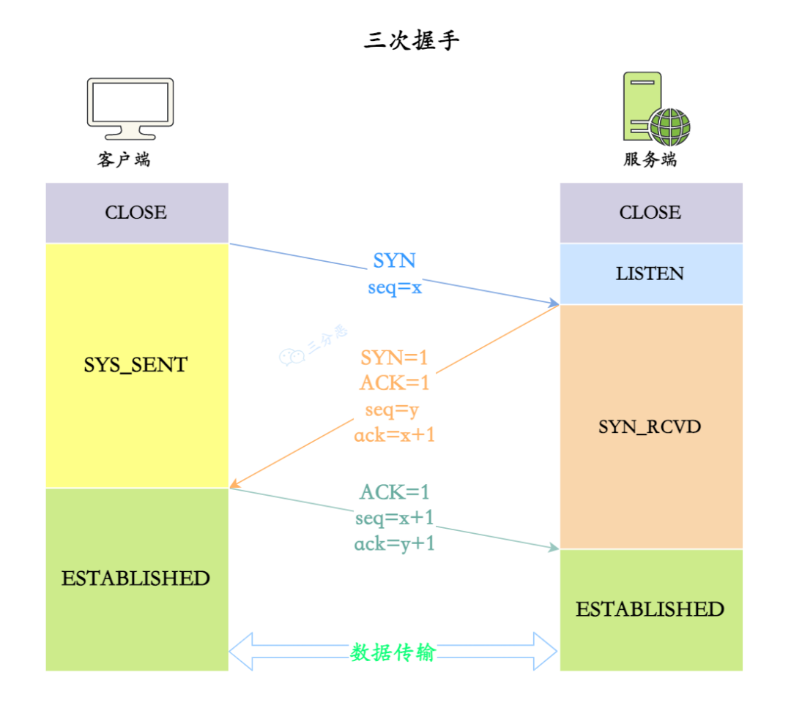
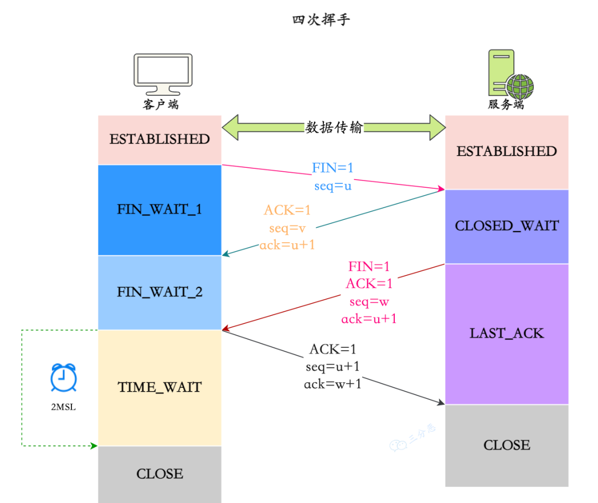
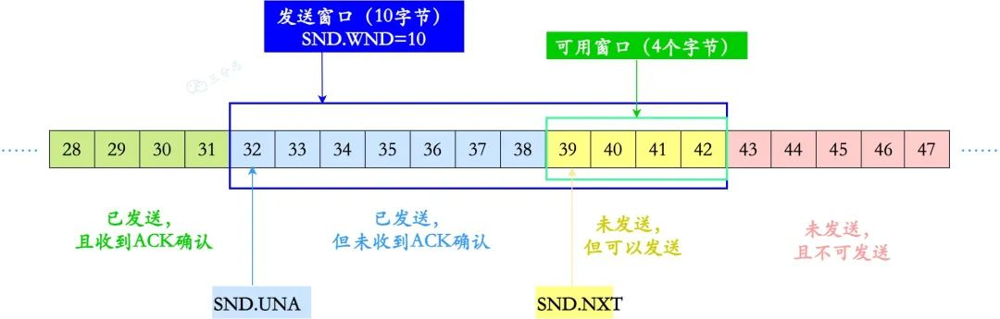
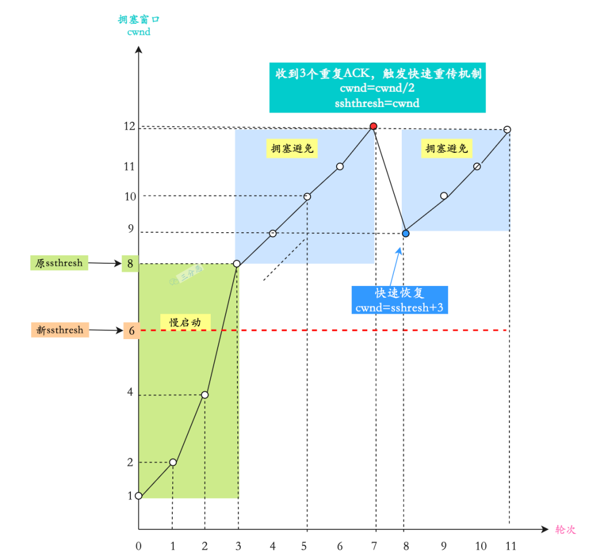

##  一、计算机网络体系结构

### 1. 体系结构

- **OSI 七层模型**：
   物理层 → 数据链路层 → 网络层 → 传输层 → 会话层 → 表示层 → 应用层
   每层功能独立，上层依赖下层。
- **TCP/IP 四层模型**：
   网络接口层（物理+链路） → 网络层 → 传输层 → 应用层。

### 2. 每层协议

| 层级       | 功能         | 常见协议                          |
| ---------- | ------------ | --------------------------------- |
| 应用层     | 提供应用服务 | HTTP、FTP、SMTP、DNS、SSH、Telnet |
| 传输层     | 端到端通信   | TCP、UDP                          |
| 网络层     | 寻址与路由   | IP、ICMP、ARP、RIP、OSPF、BGP     |
| 数据链路层 | 帧传输       | PPP、以太网、HDLC                 |
| 物理层     | 比特传输     | RJ45、光纤、IEEE802.3             |

### 3. 数据在各层之间的传输

- **发送端：** 应用层数据 → 每层封装首部（报文段） → 比特流发送
- **接收端：** 逐层解封装 → 应用层数据交付。

------

##  二、从浏览器到网页展示

### 4. 输入 URL 到页面显示

1. 浏览器解析 URL（协议、主机名、端口、路径）
2. DNS 解析域名为 IP 地址
3. 建立 TCP 连接（三次握手）
4. 浏览器发送 HTTP 请求
5. 服务器返回响应（HTML、CSS、JS）
6. 浏览器解析、渲染页面（构建 DOM、加载资源、执行脚本）

### 5. DNS 解析过程

1. 查浏览器缓存
2. 查操作系统缓存（host 文件）
3. 查路由器缓存
4. 向本地 DNS 发起递归查询
5. 若未命中：迭代查询 → 根域名服务器 → 顶级域名服务器 → 权威服务器
6. 返回 IP 并缓存。

### 6. WebSocket 与 Socket

- **Socket** 是 TCP/UDP 通信的编程接口（API 级概念）。
- **WebSocket** 是基于 HTTP/HTTPS 的全双工通信协议，连接建立后可持续传输数据。
- WebSocket 主要用于实时通信（聊天室、推送等）。

------

## 三、HTTP 协议详解

### 7. 常用状态码

- **2xx 成功**：200 OK，204 No Content
- **3xx 重定向**：301 永久重定向，302 临时，304 Not Modified
- **4xx 客户端错误**：400 Bad Request，401 Unauthorized，403 Forbidden，404 Not Found
- **5xx 服务器错误**：500 Internal Server Error，502 Bad Gateway，503 Service Unavailable

### 8. HTTP 报文结构

- **请求报文**：

  ```
  请求行（方法 + URL + 版本）
  请求头（Host、User-Agent、Cookie 等）
  空行
  请求体（POST 数据）
  ```

- **响应报文**：

  ```
  状态行（协议版本 + 状态码 + 描述）
  响应头（Content-Type、Content-Length 等）
  空行
  响应体（HTML/JSON）
  ```

### 9. HTTP 请求方式

GET、POST、PUT、DELETE、PATCH、HEAD、OPTIONS、CONNECT、TRACE

### 10. GET vs POST

| 对比项   | GET             | POST       |
| -------- | --------------- | ---------- |
| 参数位置 | URL             | 请求体     |
| 数据长度 | 有限制（2~8KB） | 无明显限制 |
| 安全性   | 明文            | 相对安全   |
| 缓存     | 可被缓存        | 默认不缓存 |
| 幂等性   | 幂等            | 非幂等     |

### 11. GET 长度限制

浏览器与服务器限制（Chrome ~8KB，IE ~2KB）；协议本身无硬性限制。

### 12. HTTP 请求过程

DNS 解析 → 建立 TCP 连接 → 发送请求报文 → 接收响应 → 关闭或复用连接。

### 13. HTTP 报文结构

与第 8 点一致。

### 14. URI 与 URL

- **URI**（统一资源标识符）是资源的唯一标识；
- **URL**（统一资源定位符）是 URI 的一种，指定了访问路径和协议（如 [http://example.com）。](http://example.com)./)

------

##  四、HTTP 版本与安全

### 15. HTTP/1.0、1.1、2.0 区别

| 版本     | 特点                                                |
| -------- | --------------------------------------------------- |
| HTTP/1.0 | 每次请求都重新建立连接（短连接）                    |
| HTTP/1.1 | 默认长连接（keep-alive）、管道化、Host 头、缓存优化 |
| HTTP/2.0 | 二进制帧、多路复用、头部压缩（HPACK）、服务器推送   |

### 16. HTTP/3

- 基于 **QUIC（UDP）** 协议实现，减少握手延迟；
- 实现多路复用、内建加密（TLS1.3）。

### 17. HTTP 长连接与超时

长连接是指客户端和服务器之间在一次 HTTP 通信完成后，不会立即断开，而是保留连接以供后续请求复用

- 通过 `Connection: keep-alive` 实现；
- 空闲超时一般 60~120 秒由服务器控制。

### 18. HTTP vs HTTPS

| 项目     | HTTP     | HTTPS            |
| -------- | -------- | ---------------- |
| 安全性   | 明文传输 | 加密传输         |
| 默认端口 | 80       | 443              |
| 加密协议 | 无       | SSL/TLS          |
| 性能     | 快       | 稍慢（握手加密） |

### 19. 为什么用 HTTPS

解决三大安全问题：

1. **窃听风险**（加密传输）
2. **篡改风险**（完整性校验）
3. **伪造风险**（数字证书验证）

### 20. HTTPS 工作流程

1. 客户端发起 HTTPS 请求
2. 服务端返回数字证书（含公钥）
3. 客户端验证证书合法性
4. 协商对称加密算法，生成随机密钥（用公钥加密传输）
5. 后续通信使用对称密钥加密。

### 21. 客户端验证证书

检查：

- 是否由受信 CA 签发
- 域名是否匹配
- 是否过期或被吊销。

### 22. HTTP 无状态

每次请求独立，服务器不保存客户端状态（需借助 Cookie/Session）。

### 23. Session 与 Cookie

- **Cookie：** 存客户端，用于保存状态信息；
- **Session：** 存服务端，通过 Cookie 中的 `SessionID` 关联。
- 关系：Session 依赖 Cookie。

------

## 五、TCP 与 UDP

### 24. TCP 三次握手



1. 客户端 → 服务端：SYN=1
2. 服务端 → 客户端：SYN=1, ACK=1
3. 客户端 → 服务端：ACK=1（可携带数据）

- SYN 是 TCP 协议中用来建立连接的一个标志位，全称为 Synchronize Sequence Numbers，也就是同步序列编号。
- 泛洪攻击（SYN Flood Attack）是一种常见的 DoS（拒绝服务）攻击，攻击者会发送大量的伪造的 TCP 连接请求，导致服务器资源耗尽，无法处理正常的连接请求。

### 25. 为什么三次不是两次

- 确保双方发送、接收能力正常；
- 避免旧连接报文干扰。

### 26. 丢包处理

超时重传；多次失败则断开连接。

### 27. 第二次握手带 SYN

ACK 是为了告诉客户端传来的数据已经接收无误而传回 SYN 是为了告诉客户端，服务端响应的确实是客户端发送的报文。

### 28. 第三次握手能携带数据（HTTP 请求常在此发送）。

### 29. 半连接队列 & SYN Flood

攻击者伪造大量 SYN，不响应 ACK，占满队列导致拒绝服务。

### 30. TCP 四次挥手



FIN → ACK → FIN → ACK（双方独立关闭）

### 31. 四次原因

TCP 是全双工，关闭需要双方确认。

### 32. 2MSL 等待

确保最后 ACK 可达，避免旧包干扰。

### 33. 保活计时器

检测长时间无活动的连接是否断开。服务器每收到一次客户端的数据，就重新设置保活计时器，时间的设置通常是两个小时。若两个小时都没有收到客户端的数据，服务端就发送一个探测报文段，以后则每隔 75 秒钟发送一次。若连续发送 10 个探测报文段后仍然无客户端的响应，服务端就认为客户端出了故障，接着就关闭这个连接。

### 34. CLOSE-WAIT 与 TIME-WAIT

- **CLOSE-WAIT：** 对方关闭，我方还未关闭。
- **TIME-WAIT：** 已发送最后 ACK，等待超时后释放。

### 35. TIME-WAIT 过多

占用端口，解决：`tcp_tw_reuse`、`tcp_tw_recycle`。

### 36. TCP 报文首部

| 字段        | 含义                  |
| ----------- | --------------------- |
| 源/目的端口 | 标识通信端口          |
| 序号        | 字节流编号            |
| 确认号      | 已收到数据编号        |
| 标志位      | SYN、ACK、FIN、RST 等 |
| 窗口        | 流量控制              |
| 校验和      | 检错                  |

### 37. TCP 可靠性机制

序号、确认、超时重传、校验和、流量控制、拥塞控制。

### 38. 流量控制

接收方通过“窗口大小”告诉发送方自己能接收的数据量。

### 39. 滑动窗口



它是操作系统开辟的一个缓存空间。窗口大小值表示无需等待确认应答，而可以继续发送数据的最大值。
TCP 头部有个字段叫 win，也即那个 16 位的窗口大小，它告诉对方本端的 TCP 接收缓冲区还能容纳多少字节的数据，这样对方就可以控制发送数据的速度，从而达到流量控制的目的。

动态调整发送窗口，支持连续发送与确认。

### 40. Nagle 算法 & 延迟确认

- **Nagle**：合并小包发送；没有已发送未确认报⽂时，⽴刻发送数据。存在未确认报⽂时，直到「没有已发送未确认报⽂」或「数据⻓度达到 MSS ⼤⼩」时，再发送数据。
- **延迟 ACK**：当没有响应数据要发送时，ACK 将会延迟⼀段时间，以等待是否有响应数据可以⼀起发送如果在延迟等待发送 ACK 期间，对⽅的第⼆个数据报⽂⼜到达了，这时就会⽴刻发送 ACK

### 41. 拥塞控制

拥塞窗⼝ **cwnd**是发送⽅维护的⼀个的状态变量，它会根据⽹络的拥塞程度动态变化的。发送窗⼝ swnd 和接收窗⼝ rwnd 是约等于的关系，那么由于加⼊了拥塞窗⼝的概念后，此时发送窗⼝的值是 swnd = min(cwnd, rwnd)，也就是拥塞窗⼝和接收窗⼝中的最⼩值。拥塞窗⼝ cwnd 变化的规则：只要⽹络中没有出现拥塞， cwnd 就会增⼤；但⽹络中出现了拥塞， cwnd 就减少；

慢启动 → 拥塞避免 → 快速重传 → 快速恢复。



### 42. 重传机制

超时重传 + 快速重传（3 次重复 ACK 触发）带选择确认的重传（SACK）和重复 SACK 四种

重传超时时间（RTO，Retransmission Timeout）不是一个固定的值，而是动态计算的，目的是为了适应不同的网络条件。计算 SRTT（Smoothed RTT，平滑往返时间），以避免单次测量中的抖动影响重传时间。

### 43. 粘包与拆包

- 粘包：多个消息粘连一起；
- 拆包：一个消息被拆分；
- 解决：固定长度、分隔符、长度字段。

### 44. TCP vs UDP

| 特性     | TCP        | UDP              |
| -------- | ---------- | ---------------- |
| 连接     | 面向连接   | 无连接           |
| 可靠性   | 有序、重传 | 不保证           |
| 速度     | 慢         | 快               |
| 场景     | 网页、邮件 | 视频、语音、游戏 |
| 首部字节 | 20-60      | 8                |

### 45. QQ 用 UDP

低延迟、实时性强，少量丢包可容忍。

### 46. UDP 不可靠原因

无连接、无确认、无重传、无流量控制。

- 不保证消息交付：不确认，不重传，无超时
- 不保证交付顺序：不设置包序号，不重排，不会发生队首阻塞
- 不跟踪连接状态：不必建立连接或重启状态机
- 不进行拥塞控制：不内置客户端或网络反馈机制

### 47. DNS 用 UDP

查询短小（单次 512B 内），无需连接，速度快；仅区域传输用 TCP。

------

## 六、IP 协议族

### 48. IP 作用

负责**寻址与路由**，实现主机间数据转发。

### 49. IP 分类

A 类（1.0.0.0-126.255.255.255）、B 类、C 类、D 组播、E 保留。

### 50. 域名与 IP 关系

- 一个域名可指向多个 IP（负载均衡）
- 一个 IP 可对应多个域名（虚拟主机）。

### 51. IPv4 地址枯竭解决方案

NAT、CIDR、IPv6（128 位地址）。

### 52. ARP 工作过程

广播询问 IP 对应的 MAC → 目标主机回复 → 缓存结果。

### 53. 为什么既有 IP 又有 MAC

IP 用于逻辑寻址（跨网络路由），MAC 用于物理寻址（局域网内传输）。

### 54. ICMP 功能

报告网络错误、诊断（ping、traceroute）。

### 55. ping 原理

发送 ICMP Echo 请求 → 等待 Echo 回复 → 计算 RTT。

## 七、安全与加密

### 56. 常见攻击

XSS、CSRF、SQL 注入、DDoS、DNS 劫持、ARP 欺骗、嗅探。

### 57. DNS 劫持

篡改域名解析结果，将用户导向假网站。

### 58. CSRF 攻击

利用用户登录态伪造请求。
 **防御：** CSRF Token、Referer 校验、SameSite Cookie。

### 59. DoS / DDoS / DRDoS

- **DoS**：单机攻击
- **DDoS**：多机分布式攻击
- **DRDoS**：反射放大攻击（利用第三方响应）。

### 60. XSS 攻击

注入恶意脚本执行。
 **防御：** 输入过滤、输出转义、CSP 策略。

### 61. 对称 vs 非对称加密

| 特性     | 对称加密 | 非对称加密     |
| -------- | -------- | -------------- |
| 密钥     | 同一密钥 | 公钥/私钥      |
| 速度     | 快       | 慢             |
| 代表算法 | AES、DES | RSA、ECC       |
| 应用     | 数据加密 | 密钥交换、签名 |

### 62. RSA vs AES

- **RSA**：非对称，用于密钥交换与数字签名。
- **AES**：对称，用于高速加密实际数据。
- **结合使用：** HTTPS 握手用 RSA 交换 AES 密钥。