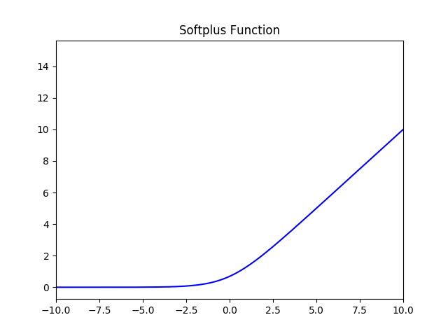
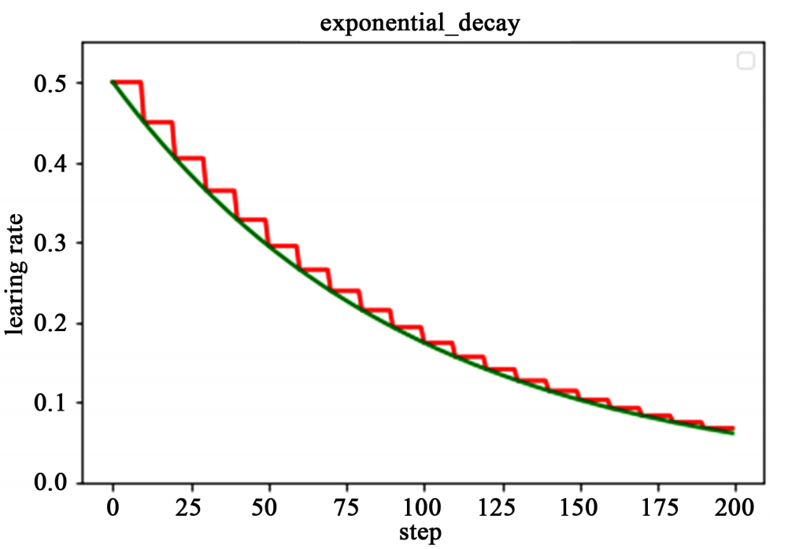

# 深度学习面试复习

1. **梯度消失和梯度爆炸**

​	梯度消失是指通过隐藏层从后向前看，梯度会变的越来越小，说明前面层的学习会显著慢于后面层的学习，所以学习会卡住，除非梯度变大。

​	梯度消失的原因受到多种因素影响，例如学习率的大小，网络参数的初始化，激活函数的边缘效应等。在深层神经网络中，每一个神经元计算得到的梯度都会传递给前一层，较浅层的神经元接收到的梯度受到之前所有层梯度的影响。如果计算得到的梯度值非常小，随着层数增多，求出的梯度更新信息将会以指数形式衰减，就会发生梯度消失。

​	在深度网络或循环神经网络（Recurrent Neural Network, RNN）等网络结构中，梯度可在网络更新的过程中不断累积，变成非常大的梯度，导致网络权重值的大幅更新，使得网络不稳定；在极端情况下，权重值甚至会溢出，变为$NaN$值，再也无法更新。

2. **深度学习和机器学习有什么不同**

**机器学习**：利用计算机、概率论、统计学等知识，输入数据，让计算机学会新知识。机器学习的过程，就是训练数据去优化目标函数。

**深度学习**：是一种特殊的机器学习，具有强大的能力和灵活性。它通过学习将世界表示为嵌套的层次结构，每个表示都与更简单的特征相关，而抽象的表示则用于计算更抽象的表示。传统的机器学习需要定义一些手工特征，从而有目的的去提取目标信息， 非常依赖任务的特异性以及设计特征的专家经验。而深度学习可以从大数据中先学习简单的特征，并从其逐渐学习到更为复杂抽象的深层特征，不依赖人工的特征工程，这也是深度学习在大数据时代受欢迎的一大原因。

3. **前向传播与反向传播**

神经网络的计算主要有两种：前向传播（foward propagation, FP）作用于每一层的输入，通过逐层计算得到输出结果；反向传播（backward propagation, BP）作用于网络的输出，通过计算梯度由深到浅更新网络参数。

4. **FeatureMap大小计算**

图像大小、步幅和卷积后的Feature Map大小是有关系的。它们满足下面的关系：

$$
W_2 = (W_1 - F + 2P)/S + 1\\
H_2 = (H_1 - F + 2P)/S + 1
$$

​	其中 $ W_2 $， 是卷积后 Feature Map 的宽度；$ W_1 $ 是卷积前图像的宽度；$ F $ 是 filter 的宽度；$ P $ 是 Zero Padding 数量，Zero Padding 是指在原始图像周围补几圈 $0$，如果 $P$ 的值是 $1$，那么就补 $1$ 圈 $0$；$S$ 是步幅；$ H_2 $ 卷积后 Feature Map 的高度；$ H_1 $ 是卷积前图像的宽度。

​	举例：假设图像宽度 $ W_1 = 5 $，filter 宽度 $ F=3 $，Zero Padding $ P=0 $，步幅 $ S=2 $，$ Z $ 则

$$
W_2 = (W_1 - F + 2P)/S + 1

= (5-3+0)/2 + 1

= 2
$$

​	说明 Feature Map 宽度是2。同样，我们也可以计算出 Feature Map 高度也是 2。

5. **Pooling层作用**

Pooling 层主要的作用是下采样，通过去掉 Feature Map 中不重要的样本，进一步==减少参数数量==。Pooling 的方法很多，最常用的是 Max Pooling。Max Pooling 实际上就是在 n\*n 的样本中取最大值，作为采样后的样本值。除了 Max Pooing 之外，常用的还有 Average Pooling ——取各样本的平均值。对于深度为 $ D $ 的 Feature Map，各层独立做 Pooling，因此 Pooling 后的深度仍然为 $ D $。

6. **神经网络更“深”有什么意义？**

==在一定范围内==

- 在神经元数量相同的情况下，深层网络结构具有更大容量，分层组合带来的是指数级的表达空间，能够组合成更多不同类型的子结构，这样可以更容易地学习和表示各种特征。
- 隐藏层增加则意味着由激活函数带来的非线性变换的嵌套层数更多，就能构造更复杂的映射关系。

7. **超参数**

​	超参数是在开始学习过程之前设置值的参数，而不是通过训练得到的参数数据。通常情况下，需要对超参数进行优化，给学习机选择一组最优超参数，以提高学习的性能和效果。

​	超参数通常存在于：

- 定义关于模型的更高层次的概念，如复杂性或学习能力。

- 不能直接从标准模型培训过程中的数据中学习，需要预先定义。

- 可以通过设置不同的值，训练不同的模型和选择更好的测试值来决定

​	超参数具体来讲比如算法中的学习率（learning rate）、梯度下降法迭代的数量（iterations）、隐藏层数目（hidden layers）、隐藏层单元数目、激活函数（ activation function）都需要根据实际情况来设置，这些数字实际上控制了最后的参数和的值，所以它们被称作超参数。

8. **如何寻找超参数的最优值**

   1. 猜测和检查：根据经验或直觉，选择参数，一直迭代。

   2. 网格搜索：让计算机尝试在一定范围内均匀分布的一组值。

   3. 随机搜索：让计算机随机挑选一组值。

   4. 贝叶斯优化：使用贝叶斯优化超参数，会遇到贝叶斯优化算法本身就需要很多的参数的困难。

   5. MITIE方法，好初始猜测的前提下进行局部优化。它使用BOBYQA算法，并有一个精心选择的起始点。由于BOBYQA只寻找最近的局部最优解，所以这个方法是否成功很大程度上取决于是否有一个好的起点。在MITIE的情况下，我们知道一个好的起点，但这不是一个普遍的解决方案，因为通常你不会知道好的起点在哪里。从好的方面来说，这种方法非常适合寻找局部最优解。稍后我会再讨论这一点。

   6. 最新提出的LIPO的全局优化方法。这个方法没有参数，而且经验证比随机搜索方法好

9. **超参数搜索一般过程：**

   1. 将数据集划分成训练集、验证集及测试集。
   2. 在训练集上根据模型的性能指标对模型参数进行优化。
   3. 在验证集上根据模型的性能指标对模型的超参数进行搜索。
   4. 步骤 2 和步骤 3 交替迭代，最终确定模型的参数和超参数，在测试集中验证评价模型的优劣。

   其中，搜索过程需要搜索算法，一般有：网格搜索、随机搜索、启发式智能搜索、贝叶斯搜索。

10. **为什么需要激活函数？**

11. 激活函数对模型学习、理解非常复杂和非线性的函数具有重要作用。

12. 激活函数可以引入非线性因素。如果不使用激活函数，则输出信号仅是一个简单的线性函数。线性函数一个一级多项式，线性方程的复杂度有限，从数据中学习复杂函数映射的能力很小。没有激活函数，神经网络将无法学习和模拟其他复杂类型的数据，例如图像、视频、音频、语音等。

3. 激活函数可以把当前特征空间通过一定的线性映射转换到另一个空间，让数据能够更好的被分类。

11. **为什么激活函数需要非线性函数？**

15. 假若网络中全部是线性部件，那么线性的组合还是线性，与单独一个线性分类器无异。这样就做不到用非线性来逼近任意函数。

2. 使用非线性激活函数 ，以便使网络更加强大，增加它的能力，使它可以学习复杂的事物，复杂的表单数据，以及表示输入输出之间非线性的复杂的任意函数映射。使用非线性激活函数，能够从输入输出之间生成非线性映射。

12. **常见的激活函数及图像**

    1. sigmoid 激活函数

       函数的定义为：$ f(x) = \frac{1}{1 + e^{-x}} $，其值域为 $ (0,1) $。

       函数图像如下：

    

    2. tanh激活函数

       函数的定义为：$ f(x) = tanh(x) = \frac{e^x - e^{-x}}{e^x + e^{-x}} $，值域为 $ (-1,1) $。

       函数图像如下：

    

    3. Relu激活函数

       函数的定义为：$ f(x) = max(0, x) $  ，值域为 $ [0,+∞) $；

       函数图像如下：

    

    4. Leak Relu 激活函数 

       函数定义为： $ f(x) =  \left\{
       \begin{aligned}
       ax, \quad x<0 \\
       x, \quad x>0
       \end{aligned}
       \right. $，值域为 $ (-∞,+∞) $。 

       图像如下（$ a = 0.5 $）：

    

    5. SoftPlus 激活函数

       函数的定义为：$ f(x) = ln( 1 + e^x) $，值域为 $ (0,+∞) $。

       函数图像如下:

    

    6. softmax 函数

       函数定义为： $ \sigma(z)_j = \frac{e^{z_j}}{\sum_{k=1}^K e^{z_k}} $。

       Softmax 多用于多分类神经网络输出。

13. **激活函数有哪些性质？**

    1. 非线性： 当激活函数是非线性的，一个两层的神经网络就可以基本上逼近所有的函数。但如果激活函数是恒等激活函数的时候，即 $ f(x)=x $，就不满足这个性质，而且如果 MLP 使用的是恒等激活函数，那么其实整个网络跟单层神经网络是等价的；
    2. 可微性： 当优化方法是基于梯度的时候，就体现了该性质；
    3. 单调性： 当激活函数是单调的时候，单层网络能够保证是凸函数；
    4. $ f(x)≈x $： 当激活函数满足这个性质的时候，如果参数的初始化是随机的较小值，那么神经网络的训练将会很高效；如果不满足这个性质，那么就需要详细地去设置初始值；
    5. 输出值的范围： 当激活函数输出值是有限的时候，基于梯度的优化方法会更加稳定，因为特征的表示受有限权值的影响更显著；当激活函数的输出是无限的时候，模型的训练会更加高效，不过在这种情况下，一般需要更小的 Learning Rate。

19. **softmax 定义及作用**

    Softmax 是一种形如下式的函数：
    $$
    P(i) = \frac{exp(\theta_i^T x)}{\sum_{i=1}^{K} exp(\theta_i^T x)}
    $$
    ​	其中，$ \theta_i $ 和 $ x $ 是列向量，$ \theta_i^T x $ 可能被换成函数关于 $ x $ 的函数 $ f_i(x) $

    ​	通过 softmax 函数，可以使得 $ P(i) $ 的范围在 $ [0,1] $ 之间。在回归和分类问题中，通常 $ \theta $ 是待求参数，通过寻找使得 $ P(i) $ 最大的 $ \theta_i $ 作为最佳参数。

    ​	但是，使得范围在 $ [0,1] $  之间的方法有很多，为啥要在前面加上以 $ e $ 的幂函数的形式呢？参考 logistic 函数：
    $$
    P(i) = \frac{1}{1+exp(-\theta_i^T x)}
    $$
    ​	这个函数的作用就是使得 $ P(i) $ 在负无穷到 0 的区间趋向于 0， 在 0 到正无穷的区间趋向 1,。同样 softmax 函数加入了 $ e $ 的幂函数正是为了两极化：正样本的结果将趋近于 1，而负样本的结果趋近于 0。这样为多类别提供了方便（可以把 $ P(i) $ 看做是样本属于类别的概率）。可以说，Softmax 函数是 logistic 函数的一种泛化。

    ​	softmax 函数可以把它的输入，通常被称为 logits 或者 logit scores，处理成 0 到 1 之间，并且能够把输出归一化到和为 1。这意味着 softmax 函数与分类的概率分布等价。它是一个网络预测多分类问题的最佳输出激活函数。

20. **Batch_Size**

    Batch的选择，首先决定的是下降的方向。

    如果数据集比较小，可采用全数据集的形式，好处是：

    1. 由全数据集确定的方向能够更好地代表样本总体，从而更准确地朝向极值所在的方向。
    2. 由于不同权重的梯度值差别巨大，因此选取一个全局的学习率很困难。 Full Batch Learning 可以使用 Rprop 只基于梯度符号并且针对性单独更新各权值。

    对于更大的数据集，假如采用全数据集的形式，坏处是：

    1. 随着数据集的海量增长和内存限制，一次性载入所有的数据进来变得越来越不可行。
    2. 以 Rprop 的方式迭代，会由于各个 Batch 之间的采样差异性，各次梯度修正值相互抵消，无法修正。这才有了后来 RMSProp 的妥协方案。 

    既然 Batch_Size 为全数据集或者Batch_Size = 1都有各自缺点，可不可以选择一个适中的Batch_Size值呢？

    ​	此时，可采用批梯度下降法（Mini-batches Learning）。因为如果数据集足够充分，那么用一半（甚至少得多）的数据训练算出来的梯度与用全部数据训练出来的梯度是几乎一样的。

21. **在合理范围内，增大Batch_Size有何好处？**

    - 内存利用率提高了，大矩阵乘法的并行化效率提高。

    - 跑完一次 epoch（全数据集）所需的迭代次数减少，对于相同数据量的处理速度进一步加快。

    - 在一定范围内，一般来说 Batch_Size 越大，其确定的下降方向越准，引起训练震荡越小。

22. **盲目增大 Batch_Size 有何坏处？**

    - 内存利用率提高了，但是内存容量可能撑不住了。

    - 跑完一次 epoch（全数据集）所需的迭代次数减少，要想达到相同的精度，其所花费的时间大大增加了，从而对参数的修正也就显得更加缓慢。

    - Batch_Size 增大到一定程度，其确定的下降方向已经基本不再变化。

23. **调节 Batch_Size 对训练效果影响到底如何？**

    Batch_Size 太小，模型表现效果极其糟糕(error飙升)。

    随着 Batch_Size 增大，处理相同数据量的速度越快。

    随着 Batch_Size 增大，达到相同精度所需要的 epoch 数量越来越多。

    由于上述两种因素的矛盾， Batch_Size 增大到某个时候，达到时间上的最优。

    由于最终收敛精度会陷入不同的局部极值，因此 Batch_Size 增大到某些时候，达到最终收敛精度上的最优。 

24. **归一化的作用**

    - 为了后面数据处理的方便，归一化的确可以避免一些不必要的数值问题。

    - 为了程序运行时收敛加快。 

    

​	当使用梯度下降法寻求最优解时，很有可能走“之字型”路线（垂直等高线走），从而导致需要迭代很多次才能收敛；而右图对两个原始特征进行了归一化，其对应的等高线显得很圆，在梯度下降进行求解时能较快的收敛。因此如果机器学习模型使用梯度下降法求最优解时，归一化往往非常有必要，否则很难收敛甚至不能收敛。

- 同一量纲。样本数据的评价标准不一样，需要对其量纲化，统一评价标准。这算是应用层面的需求。

- 避免神经元饱和。啥意思？就是当神经元的激活在接近 0 或者 1 时会饱和，在这些区域，梯度几乎为 0，这样，在反向传播过程中，局部梯度就会接近 0，这会有效地“杀死”梯度。

- 保证输出数据中数值小的不被吞食。 

25. **归一化有哪些类型？**

1. 线性归一化

$$
   x^{\prime} = \frac{x-min(x)}{max(x) - min(x)}
$$

   ​	适用范围：比较适用在数值比较集中的情况。

   ​	缺点：如果 max 和 min 不稳定，很容易使得归一化结果不稳定，使得后续使用效果也不稳定。

   2. 标准差标准化

$$
   x^{\prime} = \frac{x-\mu}{\sigma}
$$

   ​	含义：经过处理的数据符合标准正态分布，即均值为 0，标准差为 1 其中 $ \mu $ 为所有样本数据的均值，$ \sigma $ 为所有样本数据的标准差。

   3. 非线性归一化

      适用范围：经常用在数据分化比较大的场景，有些数值很大，有些很小。通过一些数学函数，将原始值进行映射。该方法包括 $ log $、指数，正切等。

26. **局部响应归一化**

   ​LRN 是一种提高深度学习准确度的技术方法。LRN 一般是在激活、池化函数后的一种方法。在 ALexNet 中，提出了 LRN 层，对局部神经元的活动创建竞争机制，使其中响应比较大对值变得相对更大，并抑制其他反馈较小的神经元，增强了模型的泛化能力。

26. **批归一化（Batch Normalization）**

​	以前在神经网络训练中，只是对输入层数据进行归一化处理，却没有在中间层进行归一化处理。要知道，虽然我们对输入数据进行了归一化处理，但是输入数据经过 $ \sigma(WX+b) $ 这样的矩阵乘法以及非线性运算之后，其数据分布很可能被改变，而随着深度网络的多层运算之后，数据分布的变化将越来越大。如果我们能在网络的中间也进行归一化处理，是否对网络的训练起到改进作用呢？答案是肯定的。 

​	这种在神经网络中间层也进行归一化处理，使训练效果更好的方法，就是批归一化Batch Normalization（BN）。

27. **批归一化（BN）算法的优点**

    下面我们来说一下BN算法的优点： 

    1. 减少了人为选择参数。在某些情况下可以取消 dropout 和 L2 正则项参数,或者采取更小的 L2 正则项约束参数； 
    2. 减少了对学习率的要求。现在我们可以使用初始很大的学习率或者选择了较小的学习率，算法也能够快速训练收敛； 
    3. 可以不再使用局部响应归一化。BN 本身就是归一化网络(局部响应归一化在 AlexNet 网络中存在) 
    4. 破坏原来的数据分布，一定程度上缓解过拟合（防止每批训练中某一个样本经常被挑选到，文献说这个可以提高 1% 的精度）。 
    5. 减少梯度消失，加快收敛速度，提高训练精度。

在CNN中，BN应作用在非线性映射前。在神经网络训练时遇到收敛速度很慢，或梯度爆炸等无法训练的状况时可以尝试BN来解决。另外，在一般使用情况下也可以加入BN来加快训练速度，提高模型精度。

​	BN比较适用的场景是：每个mini-batch比较大，数据分布比较接近。在进行训练之前，要做好充分的shuffle，否则效果会差很多。另外，由于BN需要在运行过程中统计每个mini-batch的一阶统计量和二阶统计量，因此不适用于动态的网络结构和RNN网络。

28. **什么是模型微调fine tuning**

用别人的参数、修改后的网络和自己的数据进行训练，使得参数适应自己的数据，这样一个过程，通常称之为微调（fine tuning). 

**模型的微调举例说明：**

​	我们知道，CNN 在图像识别这一领域取得了巨大的进步。如果想将 CNN 应用到我们自己的数据集上，这时通常就会面临一个问题：通常我们的 dataset 都不会特别大，一般不会超过 1 万张，甚至更少，每一类图片只有几十或者十几张。这时候，直接应用这些数据训练一个网络的想法就不可行了，因为深度学习成功的一个关键性因素就是大量带标签数据组成的训练集。如果只利用手头上这点数据，即使我们利用非常好的网络结构，也达不到很高的 performance。这时候，fine-tuning 的思想就可以很好解决我们的问题：我们通过对 ImageNet 上训练出来的模型（如CaffeNet,VGGNet,ResNet) 进行微调，然后应用到我们自己的数据集上。

29. **学习率**

在机器学习中，监督式学习通过定义一个模型，并根据训练集上的数据估计最优参数。梯度下降法是一个广泛被用来最小化模型误差的参数优化算法。梯度下降法通过多次迭代，并在每一步中最小化成本函数（cost 来估计模型的参数。学习率 (learning rate)，在迭代过程中会控制模型的学习进度。

​	在梯度下降法中，都是给定的统一的学习率，整个优化过程中都以确定的步长进行更新， 在迭代优化的前期中，学习率较大，则前进的步长就会较长，这时便能以较快的速度进行梯度下降，而在迭代优化的后期，逐步减小学习率的值，减小步长，这样将有助于算法的收敛，更容易接近最优解。故而如何对学习率的更新成为了研究者的关注点。
​	在模型优化中，常用到的几种学习率衰减方法有：分段常数衰减、多项式衰减、指数衰减、自然指数衰减、余弦衰减、线性余弦衰减、噪声线性余弦衰减

- **分段常数衰减**

​	分段常数衰减需要事先定义好的训练次数区间，在对应区间置不同的学习率的常数值，一般情况刚开始的学习率要大一些，之后要越来越小，要根据样本量的大小设置区间的间隔大小，样本量越大，区间间隔要小一点。下图即为分段常数衰减的学习率变化图，横坐标代表训练次数，纵坐标代表学习率。

​											

- **指数衰减**

​	以指数衰减方式进行学习率的更新，学习率的大小和训练次数指数相关，其更新规则为：
$$
decayed{\_}learning{\_}rate =learning{\_}rate*decay{\_}rate^{\frac{global{\_step}}{decay{\_}steps}}
$$
这种衰减方式简单直接，收敛速度快，是最常用的学习率衰减方式，如下图所示，绿色的为学习率随训练次数的指数衰减方式，红色的即为分段常数衰减，它在一定的训练区间内保持学习率不变。

​										

- **自然指数衰减**

​	它与指数衰减方式相似，不同的在于它的衰减底数是$e$，故而其收敛的速度更快，一般用于相对比较容易训练的网络，便于较快的收敛，其更新规则如下
$$
decayed{\_}learning{\_}rate =learning{\_}rate*e^{\frac{-decay{\_rate}}{global{\_}step}}
$$
​	下图为为分段常数衰减、指数衰减、自然指数衰减三种方式的对比图，红色的即为分段常数衰减图，阶梯型曲线。蓝色线为指数衰减图，绿色即为自然指数衰减图，很明可以看到自然指数衰减方式下的学习率衰减程度要大于一般指数衰减方式，有助于更快的收敛。

​										

- **多项式衰减**

​	应用多项式衰减的方式进行更新学习率，这里会给定初始学习率和最低学习率取值，然后将会按照
给定的衰减方式将学习率从初始值衰减到最低值,其更新规则如下式所示。
$$
global{\_}step=min(global{\_}step,decay{\_}steps)
$$

$$
decayed{\_}learning{\_}rate =(learning{\_}rate-end{\_}learning{\_}rate)* \left( 1-\frac{global{\_step}}{decay{\_}steps}\right)^{power} \\
 +end{\_}learning{\_}rate
$$

​	需要注意的是，有两个机制，降到最低学习率后，到训练结束可以一直使用最低学习率进行更新，另一个是再次将学习率调高，使用 decay_steps 的倍数，取第一个大于 global_steps 的结果，如下式所示.它是用来防止神经网络在训练的后期由于学习率过小而导致的网络一直在某个局部最小值附近震荡，这样可以通过在后期增大学习率跳出局部极小值。
$$
decay{\_}steps = decay{\_}steps*ceil \left( \frac{global{\_}step}{decay{\_}steps}\right)
$$
​	如下图所示，红色线代表学习率降低至最低后，一直保持学习率不变进行更新，绿色线代表学习率衰减到最低后，又会再次循环往复的升高降低。

​								

- **余弦衰减**

​	余弦衰减就是采用余弦的相关方式进行学习率的衰减，衰减图和余弦函数相似。其更新机制如下式所示：
$$
global{\_}step=min(global{\_}step,decay{\_}steps)
$$

$$
cosine{\_}decay=0.5*\left( 1+cos\left( \pi* \frac{global{\_}step}{decay{\_}steps}\right)\right)
$$

$$
decayed=(1-\alpha)*cosine{\_}decay+\alpha
$$

$$
decayed{\_}learning{\_}rate=learning{\_}rate*decayed
$$

​	如下图所示，红色即为标准的余弦衰减曲线，学习率从初始值下降到最低学习率后保持不变。蓝色的线是线性余弦衰减方式曲线，它是学习率从初始学习率以线性的方式下降到最低学习率值。绿色噪声线性余弦衰减方式。

​							

30. **正则化**
    正则化是机器学习中用于 **防止模型过拟合** 的技术，通过在损失函数中引入额外的约束或惩罚项，限制模型参数的大小或复杂度，从而提高模型在未见数据上的泛化能力。
    **正则化的优点**

    **减少过拟合**：通过约束模型复杂度，避免模型过度依赖训练数据中的噪声或特定样本。

    **提高泛化性**：使模型在测试集或真实场景中表现更稳定。

    **控制参数规模**：防止参数值过大，避免数值不稳定问题（如梯度爆炸）。

    **特征选择**：某些正则化方法（如 L1）可以自动筛选重要特征。

**常见的正则化方法**

**1. L1 正则化（Lasso Regularization）**
- **定义**：在损失函数中添加模型参数的 **L1 范数**（绝对值之和）作为惩罚项。  
- **公式**：
  $L_{\text{total}} = L(\text{原始损失}) + \lambda \sum_{i=1}^n |w_i|$
  （$w_i$ 是模型参数，$\lambda $是正则化强度）  
- **特点**：
  - 倾向于产生 **稀疏解**（部分参数直接变为 0），可用于特征选择。  
  - 适用于高维数据（如线性回归、逻辑回归）。  
  **2. L2 正则化（Ridge Regularization）**
- **定义**：在损失函数中添加模型参数的 **L2 范数**（平方和）作为惩罚项。  
- **公式**：
  $$L_{\text{total}} = L(\text{原始损失}) + \lambda \sum_{i=1}^n w_i^2$$
- **特点**：
  - 使参数值 **接近 0 但不完全为 0**，适合处理共线性问题。  
  - 广泛应用于神经网络、支持向量机（SVM）等模型。  
  **3. Elastic Net（弹性网络）**
- **定义**：结合 L1 和 L2 正则化，平衡稀疏性和稳定性。  
- **公式**：
  $L_{\text{total}} = L(\text{原始损失}) + \lambda_1 \sum |w_i| + \lambda_2 \sum w_i^2$
- **特点**：
  - 适用于特征数量远大于样本数的情况（如基因数据）。  
  **4. Dropout（随机失活）**
- **定义**：在神经网络训练过程中，随机以概率 \(p\) 暂时丢弃部分神经元（输出置 0）。  
- **特点**：
  - 防止神经元过度依赖特定特征，类似“模型平均”效果。  
  - 常用于全连接层（如 CNN、Transformer 中的 FFN 层）。  
  **5. 早停法（Early Stopping）**
- **定义**：在训练过程中监控验证集性能，当性能不再提升时提前终止训练。  
- **特点**：
  - 简单有效，避免模型在训练集上过度优化。  
  **6. 数据增强（Data Augmentation）**
- **定义**：通过对训练数据进行变换（如旋转、裁剪、添加噪声）扩充数据集。  
- **特点**：
  - 本质是通过增加数据多样性实现正则化，常用于计算机视觉（CV）和自然语言处理（NLP）。  
  **7. 批归一化（Batch Normalization, BN）**
- **定义**：对每一层的输入进行标准化（均值为 0，方差为 1），加速训练并轻微正则化。  
- **特点**：
  - 减少内部协变量偏移（Internal Covariate Shift），允许使用更大的学习率。  
  **8. 权重衰减（Weight Decay）**
- **定义**：在优化器（如 SGD、Adam）中直接对参数施加 L2 惩罚（与 L2 正则化等价）。  
**如何选择正则化方法？**

| 场景               | 推荐方法                     |
| ------------------ | ---------------------------- |
| 高维特征选择       | L1 正则化（Lasso）           |
| 防止过拟合（通用） | L2 正则化（Ridge）或 Dropout |
| 深度神经网络       | Dropout + BatchNorm + 早停法 |
| 小样本数据         | 数据增强 + Elastic Net       |

